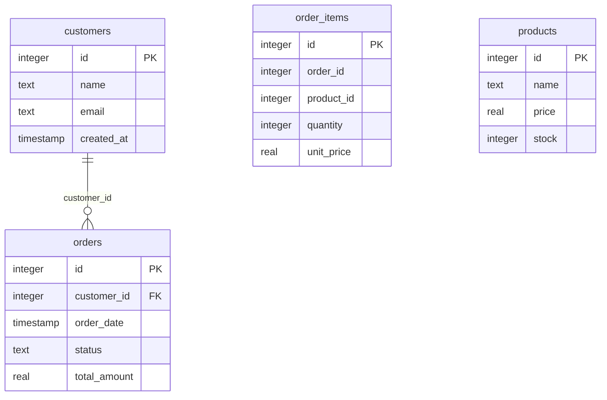

# Database Relationships Entity-Relationship (ER) Diagram

Auto-generated from live database schema by DevDB Relationship Manager.

```mermaid
erDiagram
    customers {
        integer id PK
        text name
        text email
        timestamp created_at
    }
    order_items {
        integer id PK
        integer order_id
        integer product_id
        integer quantity
        real unit_price
    }
    orders {
        integer id PK
        integer customer_id FK
        timestamp order_date
        text status
        real total_amount
    }
    products {
        integer id PK
        text name
        real price
        integer stock
    }
    customers ||--o{ orders : "customer_id"
```
